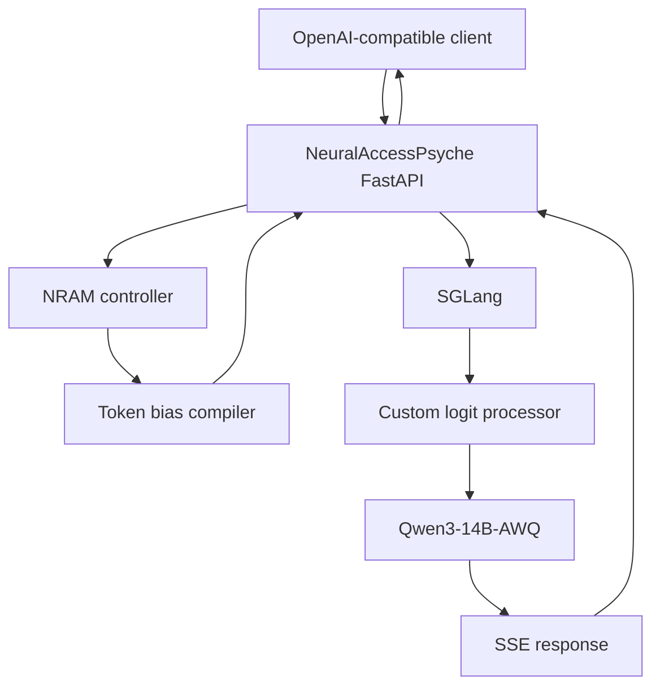

# Architecture

This document describes the end-to-end request flow through NeuralAccessPsyche: from an OpenAI-compatible client, through the FastAPI gateway, into the SGLang inference server where NRAM steers decoding, and back out as an SSE stream.

## Request flow

1. **Client → FastAPI** — An OpenAI-compatible client posts to `/v1/chat/completions` with a Bearer token.
2. **Request validation** — `validate_request()` checks the schema. The `nram` extension object is inspected and **forbidden fields are rejected** (see [`security.md`](security.md)).
3. **Persona policy compiler** — The selected persona profile (`NRAMState`) is compiled **deterministically** into a `SteeringPolicy` (positive / negative / forbidden lexemes, bias magnitudes, repetition penalty, developer instruction). Identical inputs produce identical policies (verifiable via `policy_hash`).
4. **Applied-state compiler** — Resolves the profile, request controls, prompt intervention, route, sampling, grammar, model/tokenizer identity, and defaults into a versioned canonical hash.
5. **Token bias compiler** — The `TokenBiasCompiler` uses the exact Qwen tokenizer to convert supported lexemes into concrete token IDs.
6. **Lifecycle/correlation boundary** — The API assigns a server-generated SGLang `rid`, exposes public and actual base identities, and calls SGLang's official `/abort_request` on cancellation/deadline.
7. **SGLang engine** — The engine builds an upstream payload from an explicit allowlist of fields, injects the **trusted** serialized `NRAMLogitProcessor` plus `custom_params` (token IDs + bounded bias values), and calls SGLang.
8. **Custom logit processor** — Inside SGLang, `NRAMLogitProcessor.__call__` runs per batch row: it adds positive bias, subtracts negative bias, sets forbidden tokens to `-inf`, and applies a dynamic repetition penalty against recent output — **all before sampling**.
9. **GPU decoding** — SGLang samples from the modified logits on the RTX 4090.
10. **SSE stream back** — Tokens stream back through FastAPI to the client as `chat.completion.chunk` events, terminated by `data: [DONE]`.

## Component map

| Component | Source | Responsibility |
|-----------|--------|----------------|
| FastAPI gateway | `main.py`, `api/routes.py` | OpenAI-compatible endpoints, auth, rate limiting, streaming |
| Request validation | `utils/validators.py` | Schema validation of incoming requests |
| Persona policy compiler | `core/persona/compiler.py` | `NRAMState` → `SteeringPolicy` (deterministic) |
| NRAM controller | `core/nram_controller/controller.py` | Active profile, overrides, policy hash |
| Optional planner helper | `core/persona/planner.py` | Not an advertised or required runtime mechanism; absence does not silently change logit controls |
| Token bias compiler | `core/steering/tokenizer_bias.py` | Lexemes → concrete token IDs |
| SGLang engine | `core/engines/sglang_engine.py` | Upstream payload, processor injection, SSE passthrough |
| Logit processor | `core/steering/nram_logit_processor.py` | Pre-sampling logit modification inside SGLang |
| Serialization | `core/steering/serialization.py` | Server-only `dill` serialization of the processor |

## Engine capabilities

SGLang's verified capabilities (from `core/engines/base.py`):

| Capability | Supported |
|------------|:---:|
| Streaming | ✅ |
| Strict JSON | ✅ |
| Regex grammar | ✅ |
| CFG grammar | ✅ |
| Token masking | ✅ |
| Dynamic logits | ✅ |
| Hidden-state access | ❌ |
| Mid-generation state updates | ✅ |

Because hidden-state access is not available, NRAM does **not** do activation steering here — it operates purely at the logit layer. See [`nram-steering.md`](nram-steering.md).

## Determinism

Given identical `(input, persona options, model, sampling parameters)`, the policy compiler emits identical bias parameters and an identical `policy_hash`. The only non-determinism in a generation comes from the model sampler itself (temperature, seed), which the client controls via standard OpenAI fields.
